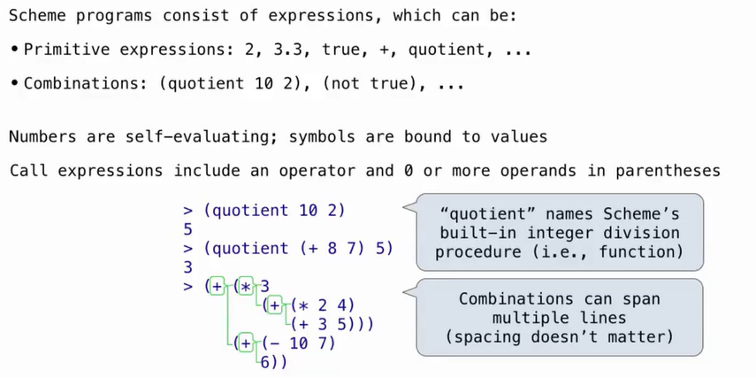
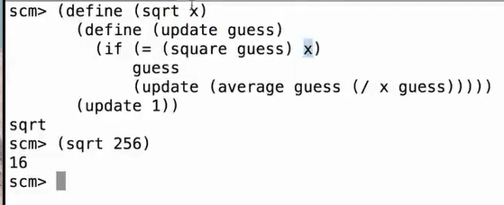
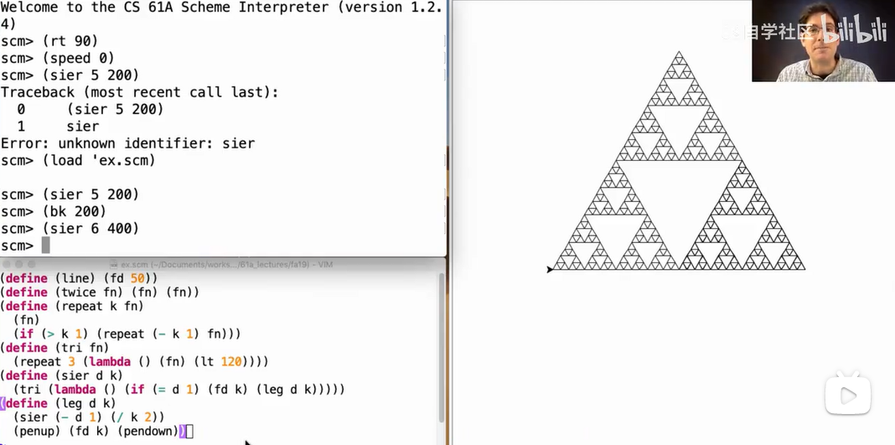

# Scheme
## Scheme Fundamentals




```scheme
(number? 123) ; #t
(number? "123") ; #f
(string? "hello") ; #t
```

## Special Forms
```scheme
(define x 10) ; define a variable x with value 10
(if #t 10 20) ; if #t is true, return 10, otherwise return 20
(cond ((= x 10) "x is 10") ((= x 20) "x is 20") (else "x is not 10 or 20")) ; conditional statement
(and #t #f) ; #f
(or #t #f) ; #t
(let ((x 10) (y 20)) (+ x y)) ; let statement to create local variables
(let* ((x 10) (y (+ x 10))) (+ x y)) ; let* statement to create local variables and use the value of previous variables
(lambda (x) (+ x 10)) ; lambda expression to create a function that adds 10 to a given number
(map (lambda (x) (+ x 10)) (list 1 2 3)) ; map function to apply a function to each element of a list
(define (sum-of-squares x y) (+ (* x x) (* y y))) ; define a function that takes two numbers and returns their sum of squares
(sum-of-squares 3 4) ; 25
```



### lambda expression
```scheme
(define (add-ten x) (+ x 10)) ; define a function that adds 10 to a given number
(add-ten 5) ; 15
```


### Cond and Begin


### let
临时绑定

define则是永久绑定




