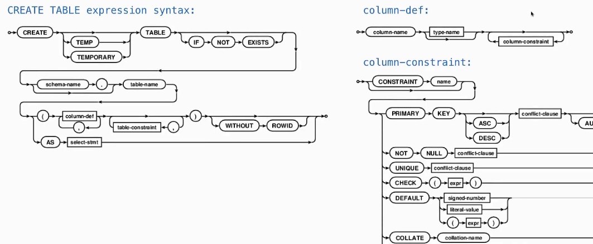
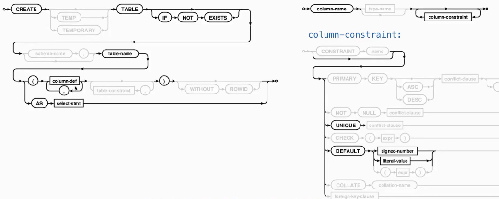
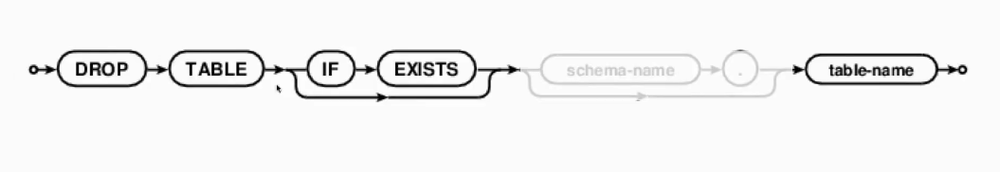
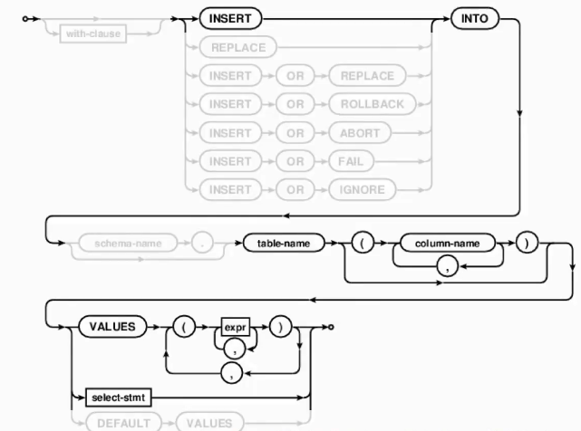

# Databases

## method of tables
### create and drop tables



:nerd_face:



```sql
create table numbers (n, note);
create table numbers (n UNIQUE, note DEFAULT 'unknown');
```


```sql
drop table if exists t;
```


### insert data into tables

```sql
insert into t values (1, 'one');
insert into t(col1) values (2);
```


